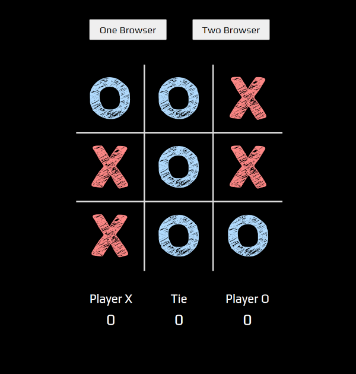
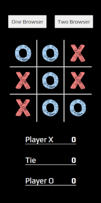
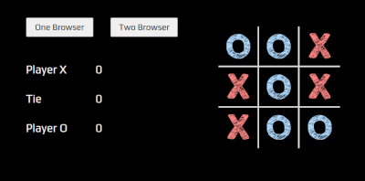

WebSocket Tic-Tac-Toe
================================

### Live Demo

[qelery.herokuapp.com](qelery.herokuapp.com)

## Usage

### Install Dependencies

```sh
npm install
```

### Start App

```sh
node app.js
```

## Features

* WebSocket Two Player - play from different devices or browsers
* Responsive Design - resizes and rearranges layout on smaller devices
* Animations - blink, shake, and fall animations


## Layouts

### Desktop


### Mobile and Tablet


