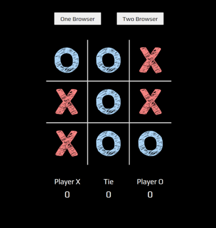
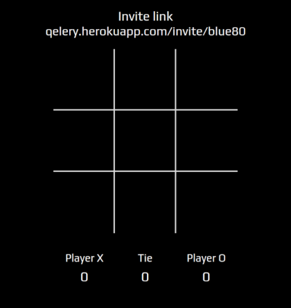
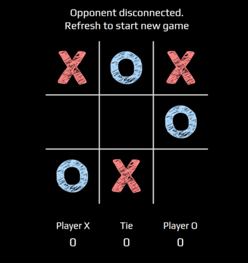
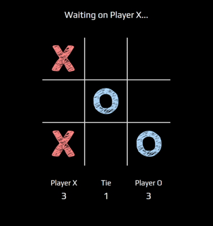
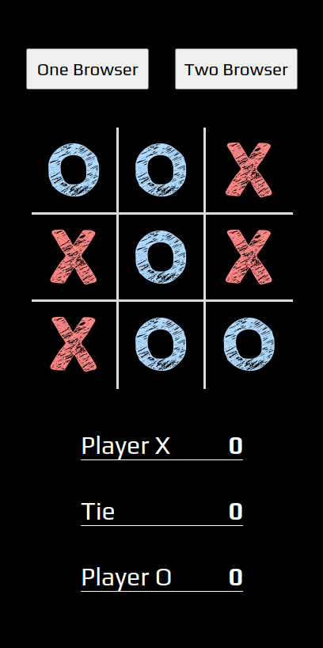
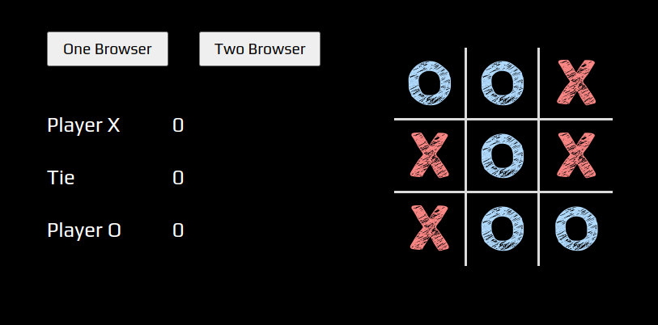
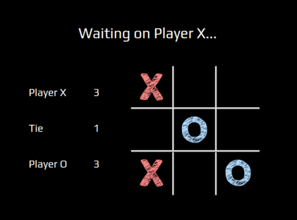

WebSocket Tic-Tac-Toe
================================

### Live Demo

[qelery.herokuapp.com](http://qelery.herokuapp.com/)

## Usage

### Install Dependencies

```sh
npm install
```

### Start App

```sh
npm start
```

## Features

* **WebSocket Two Player** - challenege your friends from different devices with an invite link
* **Responsive Design** - resizable layout to fit on smaller screens
* **Animations** - blink, shake, and fall animations


## Layouts

### Desktop





### Mobile and Tablet


